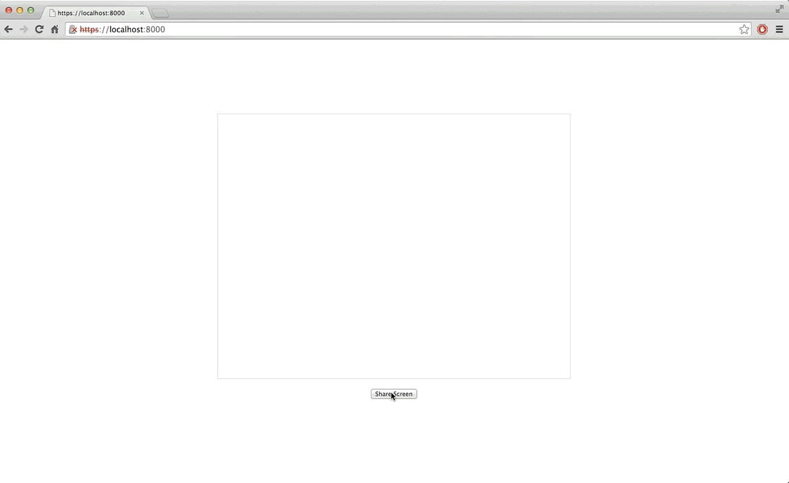
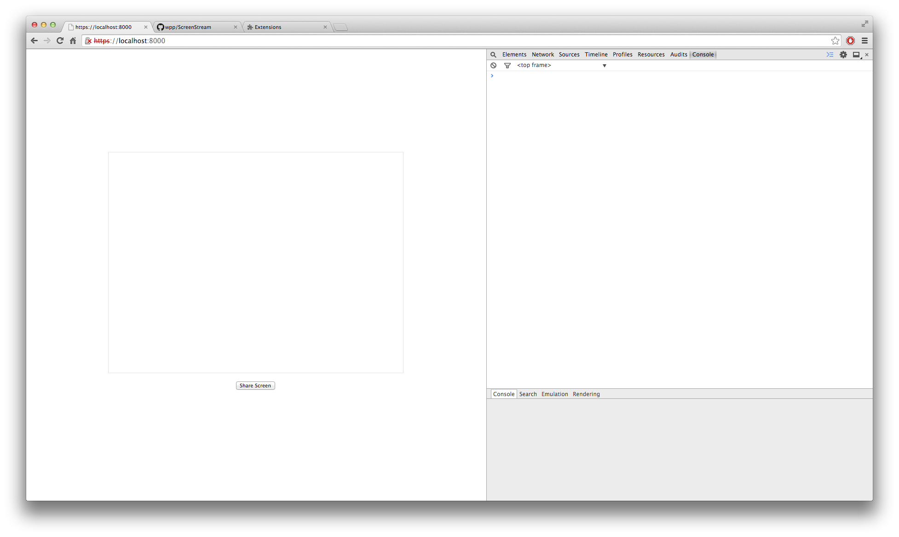
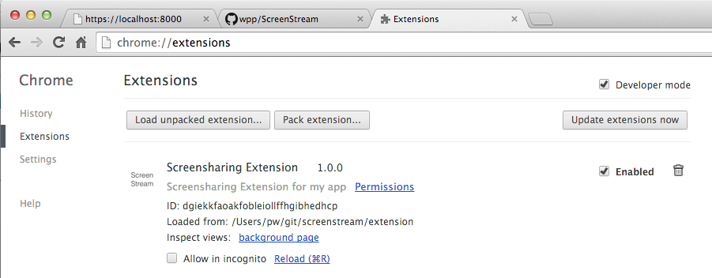

How to get create a screen stream with Chrome's `desktopCapture` API in your web-application.

# Setup

## Server

You will need to serve the `index.html` file over https.

    $ cd ~/wherever/you/cloned/the/repo/screenstream
    $ ruby server

Open Chrome and go to [https://localhost:8000]().
If everything worked you should see: 

## Extension

For the demo to work, you need to install the extension:

1. Go to [chrome://extensions/]()
2. Check "Developer mode"
3. Click "Load unpacked extension..."
4. In the dialog choose the `extension` folder from the repository

If everything worked you should see: 

NOTE: your ID will differ, that's fine though.

# Explanation

## Application (our web-app)

The `index.html` file contains a "Share screen" button, an empty `<video>` tag
and loads some javascript (`app.js`). Think of these two files as our "application".

## Extension

The extension on the other hand consits of 4 files:

1. background.js
2. content-script.js
3. manifest.json
4. icon.png // not important

### background.js

> holds the main logic of the extension

or in our case, has access to the [desktopCapture API](https://developer.chrome.com/extensions/desktopCapture). We get access to this API when we ask for permission in `manifest.json`:

    "permissions": [
      "desktopCapture",
      "https://localhost:8000/*"
    ]

The background page ("background.js" - chrome generates the related html for us) runs in the extension process and is therefore isolated from our application enviornment. Meaning that we don't have a direct way to talk to our application. That's why we have the content-script.

[1](https://developer.chrome.com/extensions/background_pages)

### content-script.js

> If your extension needs to interact with web pages, then it needs a content script. A content script is some JavaScript that executes in the context of a page that's been loaded into the browser.

[2](https://developer.chrome.com/extensions/overview#contentScripts)

The content-script does not have access to variables or functions defined on our page, but it
**has access to the DOM**.

## Glueing it together

Our mission:

We need to get a **streamId from the background page**, to call `navigator.webkitGetUserMedia` in **app.js with that streamId**. To accomplish that mission we have to pass messages through the chain below:

    // app.js            |        |content-script.js |      |background.js
    // window.postMessage|------->|port.postMessage  |----->| port.onMessage
    //                   | window |                  | port |
    // webkitGetUserMedia|<------ |window.postMessage|<-----| port.postMessage

Lets run through the chain:

When the user clicks on "Share Screen", we post a message on the **window** object, because...

    window.postMessage({ type: 'SS_UI_REQUEST', text: 'start' }, '*');

the **content-script has access to the DOM**

    window.addEventListener('message', function(event) {
        if (event.data.type && ((event.data.type === 'SS_UI_REQUEST'))) {
            port.postMessage(event.data);
        }
    }, false);

the **content-script can also talk to the background page** via:

    var port = chrome.runtime.connect(chrome.runtime.id);

the **background page listens on that same port**, for the message:

    port.onMessage.addListener(function (msg) {
      if(msg.type === 'SS_UI_REQUEST') {
        requestScreenSharing(port, msg);
      }

and finally gets access to the stream, and **sends a message back to the port and to the content-script**

    function requestScreenSharing(port, msg) {
      desktopMediaRequestId = chrome.desktopCapture.chooseDesktopMedia(data_sources, port.sender.tab, function    (streamId) {
        if (streamId) {
          msg.type = 'SS_DIALOG_SUCCESS';
          msg.streamId = streamId;
        } else {
          msg.type = 'SS_DIALOG_CANCEL';
        }
        port.postMessage(msg);
      });
    }

the content-script posts it back to app.js

    port.onMessage.addListener(function(msg) {
        window.postMessage(msg, '*');
    });

where we finally call `navigator.webkitGetUserMedia`

    if (event.data.type && (event.data.type === 'SS_DIALOG_SUCCESS')) {
      startScreenStreamFrom(event.data.streamId);
    }

    function startScreenStreamFrom(streamId) {
      navigator.webkitGetUserMedia({
        audio: false,
        video: {
          mandatory: {
            chromeMediaSource: 'desktop',
            chromeMediaSourceId: streamId,
            maxWidth: window.screen.width,
            maxHeight: window.screen.height
          }
        }
      },
      // successCallback
      function(screenStream) {
        videoElement = document.getElementById('video');
        videoElement.src = URL.createObjectURL(screenStream);
        videoElement.play();
      }

# Credits

Thanks to the guys and gals at [&yet](http://andyet.com/) for [talky.io]()

Thanks to [stackoverflow user Dima Stopel](http://stackoverflow.com/questions/14267010/how-to-create-self-signed-ssl-certificate-for-test-purposes) for:

    openssl genrsa 2048 > private.pem
    openssl req -x509 -new -key private.pem -out public.pem
