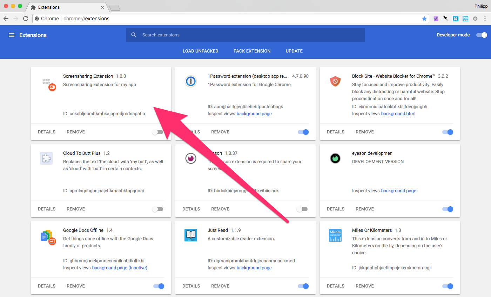

## Notes

### You might not need this anymore!

Recent Chrome versions (70 and up) [introduced
`getDisplayMedia`](https://groups.google.com/forum/?__s=seqnqtrfky2js3hsisxx#!msg/discuss-webrtc/Uf0SrR4uxzk/uO8sLrWuEAAJ)
which essentially nullify this project and the need for an extension. You can
simply acquire a screen stream with something like this:

```js
navigator.mediaDevices.getDisplayMedia({ audio: false, video: true })
  .then(stream => video.srcObject = stream)
  .catch(handleError);
```

A working demo can be found
[here](https://cdn.rawgit.com/uysalere/js-demos/master/getdisplaymedia.html).


*This project has been merged into https://github.com/GoogleChrome/webrtc in
case something doesn't work have [a look over
there.](https://github.com/webrtc/samples/tree/master/src/content/extensions/desktopcapture)*

## Introduction

*This demo app shows you how to use a Chrome extension to access the
`desktopCapture` API in your web-application.*

(If you're writing a WebRTC app with screen sharing, and want to avoid sending
users to `chrome://flags`)


## Index

- [Setup](#setup)
- [How does it work?](#how)
    - [Application (our web-app)](#app)
    - [Extension](#extension)
    - [Glueing it together](#glue)
- [Avoiding a reload after installation](#reload)
- [Credits](#credits)

<a name="setup"></a>
# Setup

For the Demo to work, you will need to install the extension

1. Go to [chrome://extensions]()
2. Check "Developer mode"
3. Click "Load unpacked extension..."
4. In the dialog choose the `extension` folder from the repository

You should see: 

NOTE: your ID will differ, that's fine though.

<a name="how"></a>
# How does it work?

<a name="app"></a>
## Application (our web-app)

The `index.html` file contains a "Share screen" button, an empty `<video>` tag
and loads some javascript (`app.js`). Think of these two files as our
"application".

<a name="extension"></a>
## Extension

The extension consists of 4 files:

1. background.js
2. content-script.js
3. manifest.json
4. icon.png // not important

### background.js

> holds the main logic of the extension

or in our case, has access to the [desktopCapture
API](https://developer.chrome.com/extensions/desktopCapture). We get access to
this API when we ask for permission in `manifest.json`:

    "permissions": [
      "desktopCapture"
    ]

The background page ("background.js" - chrome generates the related html for us)
runs in the extension process and is therefore isolated from our application
environment. Meaning that we don't have a direct way to talk to our application.
That's why we have the content-script.

[1](https://developer.chrome.com/extensions/background_pages)

### content-script.js

> If your extension needs to interact with web pages, then it needs a content
> script. A content script is some JavaScript that executes in the context of a
> page that's been loaded into the browser.

[2](https://developer.chrome.com/extensions/overview#contentScripts)

The content-script does not have access to variables or functions defined on our
page, but it **has access to the DOM**.

<a name="glue"></a>
## Glueing it together


In order to call `navigator.mediaDevices.getUserMedia` in **app.js**, we need a
`chromeMediaSourceId` which we get from our **background page**.

We have to pass messages through the chain below (left to right):

    app.js            |        |content-script.js |      |background.js       | desktopCapture API
    ------------------|        |------------------|      |--------------------|
    window.postMessage|------->|port.postMessage  |----->|port.onMessage------+
                      | window |                  | port |                 get|*streamID*
    getUserMedia      |<------ |window.postMessage|<-----|port.postMessage<---+

Lets run through the chain:

When the user clicks on "Share Screen", we post a message to **window**,
because...

    window.postMessage({ type: 'SS_UI_REQUEST', text: 'start' }, '*');

the **content-script has access to the DOM.**

    window.addEventListener('message', event => {
      if (event.data.type === 'SS_UI_REQUEST') {
        port.postMessage(event.data);
      }
    }, false);

the content-script can also **talk to the background page**

    var port = chrome.runtime.connect(chrome.runtime.id);

the **background page is listening on that port**,

    port.onMessage.addListener(function (msg) {
      if(msg.type === 'SS_UI_REQUEST') {
        requestScreenSharing(port, msg);
      }

gets access to the stream, and **sends a message containing the
chromeMediaSourceId (`streamID`) back to the port** (the content-script)

    function requestScreenSharing(port, msg) {
      desktopMediaRequestId =
      chrome.desktopCapture.chooseDesktopMedia(data_sources, port.sender.tab,
      streamId => {
        msg.type = 'SS_DIALOG_SUCCESS';
        msg.streamId = streamId;
        port.postMessage(msg);
      });
    }

the content-script posts it back to app.js

    port.onMessage.addListener(msg => {
        window.postMessage(msg, '*');
    });

where we finally call `navigator.mediaDevices.getUserMedia` with the `streamID`

    if (event.data.type && (event.data.type === 'SS_DIALOG_SUCCESS')) {
      startScreenStreamFrom(event.data.streamId);
    }

    function startScreenStreamFrom(streamId) {
      navigator.mediaDevices
        .getUserMedia({
          audio: false,
          video: {
            mandatory: {
              chromeMediaSource: 'desktop',
              chromeMediaSourceId: streamId
            }
          }
        })
        .then(stream => {
          videoElement = document.getElementById('video');
          videoElement.srcObject = stream;
        })

*Please note that the code examples in this README are edited for brevity,
complete code is in the corresponding files.*

<a name="reload"></a>
# Avoiding a reload after installation

*This part was inspired by
[fippo from &yet](https://blog.andyet.com/2015/03/30/talky-first-time-ux-matters).*

When the extension is installed, the content-script will not be injected automatically by Chrome.
The good news is that `background.js` will be exectued and we can use it to manually inject the
`content-script.js` in our open pages (tabs):

The relevant code can be found in `background.js` and looks something like:

    chrome.tabs.executeScript(currentTab.id, { file: 'js/content-script.js' }, () => {
      console.log('Injected content-script.');
    });

**Please note: For this to work, you have to adjust `manifest.json` by adding `"tabs"` to the permissions section.**

<a name="credits"></a>
# Credits

Thanks to the guys and gals at [&yet](http://andyet.com/) for [talky.io]()

# License

[MIT](http://opensource.org/licenses/MIT)
